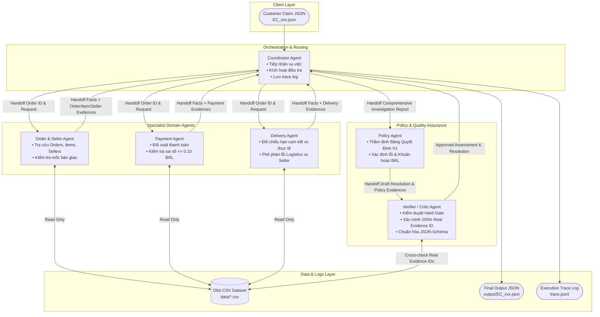

# Kiến Trúc Multi-Agent Giải Quyết Khiếu Nại Đơn Hàng (E-commerce Dispute Resolution)

Tài liệu này mô tả sơ đồ kiến trúc, vai trò nghiệp vụ, quyền truy cập dữ liệu và luồng chuyển giao thông tin (handoff pipeline) của hệ thống Multi-Agent được thiết kế nhằm điều tra và giải quyết tự động các khiếu nại khách hàng trên bộ dữ liệu Olist.

---

## 1. Triết Lý Thiết Kế: "Verifiable Data First" & "No Single Prompt Megalith"

Hệ thống tuân thủ 3 quy tắc bất khả xâm phạm:
1. **Chia để trị (Domain Specialization & Handoffs):** Mỗi Agent đảm nhận một phạm trù nghiệp vụ chuyên biệt (Đơn hàng/Người bán, Thanh toán, Giao vận, Chính sách, và Kiểm duyệt). Luồng giao tiếp là quy trình handoff mạch lạc, tường minh. Tuyệt đối không gộp chung logic vào một prompt hay function đơn lẻ.
2. **Ưu tiên sự thật kiểm chứng được (Ground Truth Enforcement):** Lời phản ánh của khách hàng (claim message) chỉ mang tính khởi tạo vụ việc. Hệ thống không đặt niềm tin tuyệt đối vào claim và không bao giờ tự suy diễn các sự kiện vô hình (như giao thiếu, giao sai mã hàng, hay giao dịch bên ngoài). Mọi bằng chứng (Evidence) phải được cẩu ngược lại từ cơ sở dữ liệu CSV có thật.
3. **Ràng buộc quy mô Mô hình ($\le$ 10B Parameters):** Tất cả các Agent được thiết kế để hoạt động ổn định trên các mô hình có quy mô dưới 10 tỷ tham số (như `gemma-2-9b-it`, `llama-3.1-8b-instant`), kết hợp sự hỗ trợ từ cơ chế lập luận logic theo cấu trúc (structured reasoning & deterministic tool routing).

---

## 2. Sơ Đồ Đội Ngũ Agent (Agent Topology & Handoffs)

---

## 3. Chi Tiết Vai Trò & Quyền Truy Cập Của Từng Agent

| Agent Name | Vai Trò Nghiệp Vụ | Quyền Truy Cập Dữ Liệu | Output / Evidence Handoff |
| :--- | :--- | :--- | :--- |
| **Coordinator Agent** | Điều phối toàn diện. Đọc file `input/`, gửi lệnh điều tra đến các Domain Agent, gom nhỡ thông tin, điều hướng cho Policy và Verifier, cuối cùng ghi file log và kết quả JSON. | Đọc file `input/*.json`, Ghi file `output/*.json` & `trace.jsonl` | Nhật ký Handoff Trace, Tổng hợp báo cáo dữ liệu vụ việc. |
| **Order & Seller Agent** | Trao đổi thợ mỏ với CSDL đơn hàng. Xác minh trạng thái đơn, danh sách item, ID của seller. Đặc biệt kiểm tra xem Seller có bàn giao cho bên vận chuyển trước hạn `shipping_limit_date` hay không. | Read-Only: `olist_orders_dataset.csv`, `olist_order_items_dataset.csv`, `olist_sellers_dataset.csv` | Các sự kiện đơn hàng; Evidence IDs: `order:<order_id>`, `item:<order_id>:<order_item_id>`, `seller:<seller_id>`. |
| **Payment Agent** | Kiểm soát viên tài chính. Tra cứu tổng số dòng thanh toán (`payment_sequential`) và giá trị `payment_value`. Đối chiếu tổng tiền đã thanh toán với tổng giá trị hàng (`item_total`) + phí ship (`freight_total`). Kiểm tra sai số hợp lệ trong mức $\le 0.10$ BRL. | Read-Only: `olist_order_payments_dataset.csv` (kết hợp với dữ liệu tiền từ Item) | Báo cáo chênh lệch thanh toán; Evidence IDs: `payment:<order_id>:<payment_sequential>`. |
| **Delivery Agent** | Chuyên viên theo dõi bưu phẩm. Đánh giá thời gian giao hàng thực tế tới khách (`order_delivered_customer_date`) so với thời gian cam kết (`order_estimated_delivery_date`). Nếu trễ hạn, xác định trách nhiệm thuộc bên Seller (giao chậm cho bưu kiện) hay do bên Logistics (nhận đúng hạn nhưng phát muộn). | Read-Only: `olist_orders_dataset.csv`, `olist_order_items_dataset.csv` | Kết luận trạng thái giao hàng (On-time / Late Seller / Late Logistics); Không tự phát sinh ID, hỗ trợ bằng chứng mốc thời gian. |
| **Policy Agent** | Thẩm phán nghiệp vụ. Áp dụng bảng Quy Tắc V1 (`EC_POLICY_V1`) theo nghiêm ngặt **thứ tự ưu tiên (1 đến 6)**: `canceled` $\rightarrow$ `unavailable` $\rightarrow$ `late seller` $\rightarrow$ `late logistics` $\rightarrow$ `valid split` $\rightarrow$ `unsupported claim`. Chốt số tiền bồi thường (`recommended_refund_brl`), hành động và mức độ tự tin (`confidence`). | Không truy cập CSV trực tiếp; xử lý trên Hồ sơ kết quả Handoff từ 3 Domain Agent. | Phán quyết chi tiết vụ việc; Evidence ID: `policy:<root_cause_code>` (ví dụ: `policy:SELLER_HANDOFF_AFTER_LIMIT`). |
| **Verifier / Critic Agent** | Cảnh sát kiểm duyệt **Hard Gate**. Rà soát từng ID xuất hiện trong `affected_entities` và `evidence_ids`, đối chiếu ngược với CSV để đảm bảo 100% ID là có thật (loại bỏ ảo giác False Positive). Validate chuẩn JSON: không quá 5 IDs/entity, không quá 10 evidences, làm tròn tiền tệ 2 chữ số thập phân, ép 0.0 BRL nếu đơn không có Item row. | Read-Only toàn bộ CSDL CSV (để xác minh sự tồn tại của ID). | Báo cáo Phê chuẩn (Approved JSON Output Structure) an toàn 100% tuyệt đối. |

---

## 4. Luồng Chuyển Giao Thông Tin (Handoff Pipeline) Của Một Vụ Việc

Một ca khiếu nại (ví dụ `EC_001.json`) đi qua chuỗi Handoff như sau:

1. **[Step 0 - Intake]**: `Coordinator` load file JSON của khách, xác định `claimed_order_id`, khởi tạo bản ghi Trace.
2. **[Step 1 - Domain Investigation]**: `Coordinator` thực hiện Handoff song song / tuần tự cho 3 chuyên gia:
   - `Order & Seller Agent` báo cáo đơn `1b9ecfe...` đang ở `order_status = canceled`, gửi kèm Evidence `order:1b9ecfe...`.
   - `Payment Agent` báo cáo đơn có 1 dòng boleto giá `33.34 BRL`, gửi kèm Evidence `payment:1b9ecfe...:1`.
   - `Delivery Agent` báo cáo đơn bị hủy trước khi gửi nên không có ngày giao thực tế.
3. **[Step 2 - Policy Adjudication]**: `Coordinator` chuyển toàn bộ facts cho `Policy Agent`. `Policy Agent` chiếu vào quy tắc ưu tiên số 1: Đơn bị canceled mà tổng payment > 0 $\rightarrow$ Phát lệnh bồi thường `primary_issue = canceled_order_paid`, trách nhiệm thuộc về `platform` (`OLIST_PLATFORM`), hoàn trả toàn bộ `33.34 BRL`, action là `issue_full_refund`. Gửi kèm Evidence `policy:ORDER_CANCELED_AFTER_PAYMENT`.
4. **[Step 3 - Verification & Hard Gate Auditing]**: `Verifier Agent` nhận dự thảo phán quyết. Từng chuỗi ID được chốt với dữ liệu thô: xác minh đúng mã đơn `1b9ecfe...`, đúng dòng payment `1`, tiền làm tròn `33.34`, và các trường trống (do không có item row) được đưa về rỗng `[]` và `0.0 BRL`.
5. **[Step 4 - Output & Tracing]**: `Coordinator` chốt file JSON cuối cùng vào `output/EC_001.json` và ghi chép chuỗi hành động này thành 1 dòng nhật ký JSONL đầy đủ trong `trace.jsonl`.
