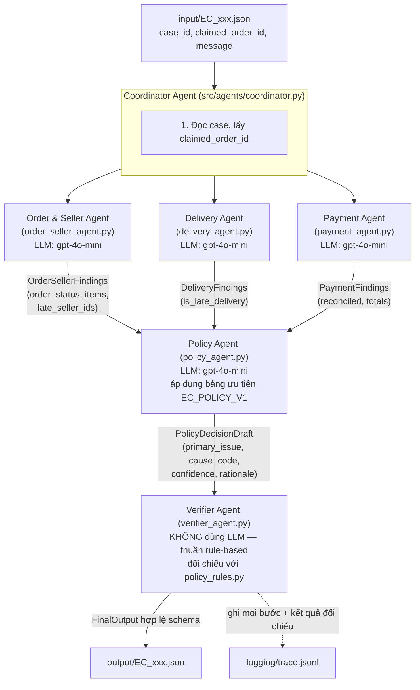

# Kiến trúc Multi-Agent — EC Dispute Resolution

## 1. Sơ đồ luồng agent



## 2. Vai trò, quyền truy cập từng agent

| Agent | Vai trò | Dữ liệu được truy cập | LLM? | Đầu ra (handoff) |
| --- | --- | --- | --- | --- |
| **Coordinator** | Nhận 1 case, gọi lần lượt các agent theo đúng thứ tự phụ thuộc, gom kết quả, ghi trace. | Chỉ đọc `case_id`, `claimed_order_id`, `message` từ input JSON. Không đọc CSV trực tiếp. | Không | Gọi tuần tự 5 agent bên dưới |
| **Order & Seller Agent** | Xác định trạng thái đơn, danh sách item, seller nào bàn giao cho carrier sau `shipping_limit_date` của item mình phụ trách. | `olist_orders_dataset.csv` (chỉ `order_status`, `order_delivered_carrier_date`), `olist_order_items_dataset.csv`. **Không thấy payment, không thấy estimated/delivered_customer_date.** | Có (tóm tắt phát hiện) | `OrderSellerFindings` |
| **Delivery Agent** | So sánh ngày giao thực tế với ngày giao dự kiến. | `olist_orders_dataset.csv` (chỉ 3 cột mốc thời gian giao hàng). **Không thấy item, seller, payment.** | Có (tóm tắt phát hiện) | `DeliveryFindings` |
| **Payment Agent** | Đối soát tổng payment với tổng item + freight, sai số 0.10 BRL. | `olist_order_payments_dataset.csv`, giá/freight từ `olist_order_items_dataset.csv` (chỉ để tính tổng). **Không thấy seller, không thấy ngày giao.** | Có (tóm tắt phát hiện) | `PaymentFindings` |
| **Policy Agent** | Áp bảng ưu tiên `EC_POLICY_V1` lên 3 findings đã nhận, chọn `primary_issue` + `cause_code`. | **Không đọc CSV** — chỉ nhận findings đã được 3 agent trên tổng hợp (không có quyền tự ý tra dữ liệu thô). | Có (suy luận chọn rule) | `PolicyDecisionDraft` |
| **Verifier Agent** | Đối chiếu đề xuất của Policy Agent với `policy_rules.py` (rule engine thuần Python dựng lại từ CSV gốc); tự tính `financial_resolution`, `affected_entities`, `evidence_ids`; validate từng evidence ID thực sự tồn tại trong CSV; ép giới hạn số lượng theo schema; validate bằng Pydantic trước khi ghi file. | Đọc lại CSV gốc qua `policy_rules.py`/`data_access.py` để tính ground-truth độc lập. | **Không** — cố ý thuần rule-based để đảm bảo số liệu tài chính và evidence ID chính xác tuyệt đối, không phụ thuộc khả năng tính toán của LLM. | `FinalOutput` (ghi vào `output/`) |

## 3. Vì sao Verifier không dùng LLM

Các trường bị chấm điểm nặng nhất (`financial_resolution` 20%, `affected_entities` 20%, `evidence_ids` 15%) đều là số liệu **suy ra trực tiếp và duy nhất** từ CSV theo `EC_POLICY_V1` — không có chỗ cho diễn giải. Để tránh rủi ro LLM cộng/so sánh ngày sai, các agent LLM chỉ **diễn giải bằng lời** các cờ boolean/số liệu đã được tính sẵn bằng Python (`is_late_delivery`, `late_seller_ids`, `reconciled`, tổng tiền...), còn phép tính thật nằm trong `src/policy_rules.py` — dùng lại ở cả 3 nơi: worker agent (tính cờ), Policy Agent prompt (cung cấp cờ để suy luận chọn rule) và Verifier (ground truth cuối để ghi file). Nếu `PolicyDecisionDraft` của Policy Agent lệch với ground truth, Verifier **luôn ưu tiên ground truth** và ghi lại sự bất đồng vào `trace.jsonl` (`match: false`) để có thể audit.

## 4. Luồng handoff theo thứ tự thực thi

1. `Coordinator` đọc case, lấy `claimed_order_id`.
2. `Order & Seller Agent` → `Delivery Agent` → `Payment Agent` chạy tuần tự (độc lập với nhau, mỗi agent tự truy vấn đúng phạm vi dữ liệu của mình qua `data_access.py`), mỗi agent trả về một object Pydantic riêng.
3. `Coordinator` gộp 3 findings + nguyên văn `customer_request.message`, chuyển cho `Policy Agent`.
4. `Policy Agent` áp bảng ưu tiên (nhúng trong system prompt), trả `PolicyDecisionDraft`.
5. `Verifier Agent` nhận draft, tính lại ground truth độc lập từ CSV, đối chiếu, dựng `FinalOutput` theo đúng schema README, validate giới hạn (≤5 entity mỗi loại, ≤10 evidence, ≤3 root cause, ≤3 responsible party, ≤5 action), rồi trả lại cho `Coordinator`.
6. `main.py` ghi `output/EC_xxx.json` và append một dòng JSON mô tả toàn bộ 5 bước (input/output từng agent, thời gian chạy, kết quả đối chiếu) vào `logging/trace.jsonl`.

Nếu bất kỳ bước LLM nào lỗi (rate limit, timeout...), `main.py` fallback sang chạy thuần `policy_rules.py` + `Verifier Agent` (bỏ qua 4 agent LLM) để case vẫn có output hợp lệ thay vì bị bỏ trống — trace ghi rõ `"status": "fallback"` và lý do lỗi.

## 5. Data access boundary (tổng hợp)

```
Order & Seller Agent   -> orders.order_status, orders.order_delivered_carrier_date, order_items.*
Delivery Agent         -> orders.order_delivered_carrier_date/customer_date/estimated_delivery_date
Payment Agent          -> order_payments.*, order_items.price/freight_value (chỉ để tính tổng)
Policy Agent           -> (không CSV) chỉ 3 findings + customer message
Verifier Agent         -> toàn bộ CSV (qua policy_rules.py) để tính ground truth độc lập
```

Mỗi agent worker chỉ nhận đúng các cột cần thiết cho vai trò của mình trong prompt — không agent nào được truyền toàn bộ dòng CSV thô của các domain khác, nhằm mô phỏng đúng ranh giới trách nhiệm như một quy trình xử lý khiếu nại thật (mục 1, README.md).
