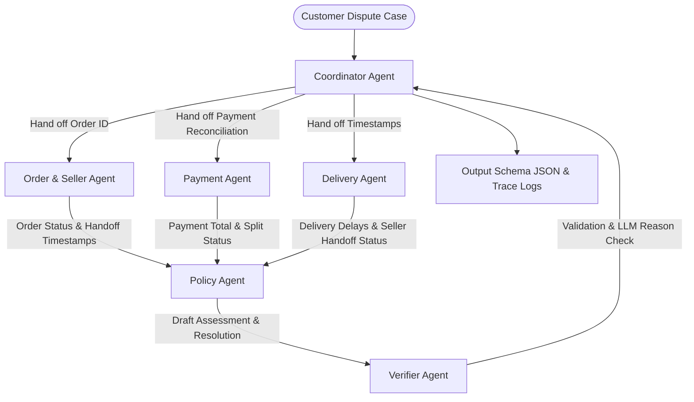

# Architecture Documentation — Multi-Agent E-commerce Dispute Resolution

## 1. Executive Summary & Overview

Hệ thống Multi-Agent được thiết kế để tự động hóa quy trình điều tra khiếu nại thương mại điện tử trên cơ sở dữ liệu Olist. Mỗi Agent đảm nhận chuyên môn theo từng domain dữ liệu (Đơn hàng, Người bán, Thanh toán, Vận chuyển, Chính sách, Kiểm chứng), truyền nhận bằng chứng qua Handoff protocol và tổng hợp thành báo cáo xử lý chuẩn hóa.

---

## 2. Agent Roles, Scope & Permissions

| Agent Name | Primary Responsibility | Data Access Scope | Actions & Handoff Duties |
| :--- | :--- | :--- | :--- |
| **Coordinator Agent** | Nhận case, điều phối công việc giữa các agent worker, ghi vết audit log và xuất kết quả cuối cùng. | Read `input/*.json`, Write `output/*.json`, Write `logging/trace.jsonl` | Chuyển order_id cho worker agent, thu thập kết quả và chuyển giao cho Verifier Agent. |
| **Order & Seller Agent** | Kiểm tra trạng thái đơn hàng (`orders.csv`), danh sách mặt hàng (`order_items.csv`), seller và mốc bàn giao hàng (`shipping_limit_date`). | Read `olist_orders_dataset.csv`, `olist_order_items_dataset.csv`, `olist_sellers_dataset.csv` | Tính `item_total_brl`, `freight_total_brl`, xác định item_ids, seller_ids và cờ muộn bàn giao seller. |
| **Payment Agent** | Chấp nhận và đối soát thông tin thanh toán (`order_payments.csv`). | Read `olist_order_payments_dataset.csv` | Tính `payment_total_brl`, kiểm tra split payment (>=2 payment rows), đối soát khớp giá trị đơn trong 0.10 BRL. |
| **Delivery Agent** | So sánh mốc thời gian giao hàng thực tế (`order_delivered_customer_date`) với mốc cam kết (`order_estimated_delivery_date`). | Internal memory based on Order & Item timestamps | Đánh giá trễ giao hàng thực tế và gán trách nhiệm giao trễ (bên vận chuyển hay seller). |
| **Policy Agent** | Áp dụng chính sách `EC_POLICY_V1` theo đúng thứ tự ưu tiên quy tắc nghiệp vụ. | Policy rules & findings from Order, Payment, Delivery Agents | Xác định `primary_issue`, `root_cause`, `responsible_parties`, `evidence_ids` và `recommended_refund_brl`. |
| **Verifier Agent** | Kiểm tra giới hạn số lượng ID, định dạng schema, kiểu dữ liệu, làm tròn tài chính và kiểm tra lý luận qua LLM (Model <= 10B). | System draft outputs & LLM Integration API | Đảm bảo tính nhất quán schema (Hard Gate validation) trước khi Coordinator xuất file. |

---

## 3. Handoff Flow & Inter-Agent Protocol

1. **Phase 1: Ingestion & Dispatch**
   - `CoordinatorAgent` đọc file case trong `input/`, trích xuất `claimed_order_id`.
   - Dispatch `claimed_order_id` đến `OrderSellerAgent` và `PaymentAgent`.

2. **Phase 2: Domain Analysis**
   - `OrderSellerAgent` truy vấn đơn hàng & mặt hàng & người bán, tính tổng tiền item + freight, kiểm tra `shipping_limit_date`.
   - `PaymentAgent` truy vấn bảng thanh toán, tổng hợp số tiền payment, tính chênh lệch so với tổng item + freight, gắn cờ reconciliation.
   - `DeliveryAgent` nhận dữ liệu thời gian từ `OrderSellerAgent`, so sánh mốc giao hàng thực tế với estimated date.

3. **Phase 3: Policy Decision Synthesis**
   - `PolicyAgent` nhận thông tin tổng hợp từ 3 domain agent, duyệt qua 6 ưu tiên chính sách `EC_POLICY_V1` từ cao xuống thấp:
     1. `canceled_order_paid`
     2. `unavailable_order_paid`
     3. `late_delivery_seller`
     4. `late_delivery_logistics`
     5. `valid_split_payment`
     6. `unsupported_late_claim`
   - Tạo danh sách `evidence_ids` chuẩn hóa và tính số tiền hoàn trả đề xuất.

4. **Phase 4: Verification & Audit Output**
   - `VerifierAgent` thẩm định toàn bộ cấu trúc JSON, giới hạn max 5 entity IDs, max 10 evidence IDs, max 3 root causes/responsible parties, max 5 actions, và gọi LLM reasoning.
   - `CoordinatorAgent` lưu trace vào `logging/trace.jsonl` và ghi kết quả ra `output/<case_id>.json`.
